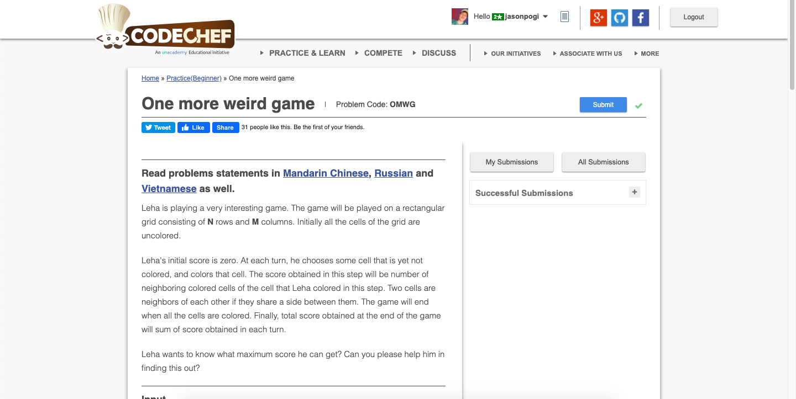

# Codechef-One-more-weird-game
### Problem

### Program Simulation
<pre>
  Sample Input: 2 2
  
  n = 2
  m = 2
  
  a = n - 1 = 1
  a = 1
  
  d = 1 + ((n - 1) * 2) = 1 + 2 = 3
  d = 3
  
  ans = 0
  
  if(m > 1) // true
    ans = a + ((m - 1) * d)) = 1 + ((2 - 1) * 3) = 1 + 3 = 4
    
  print ans
  
  Final Output:
  4
</pre>
